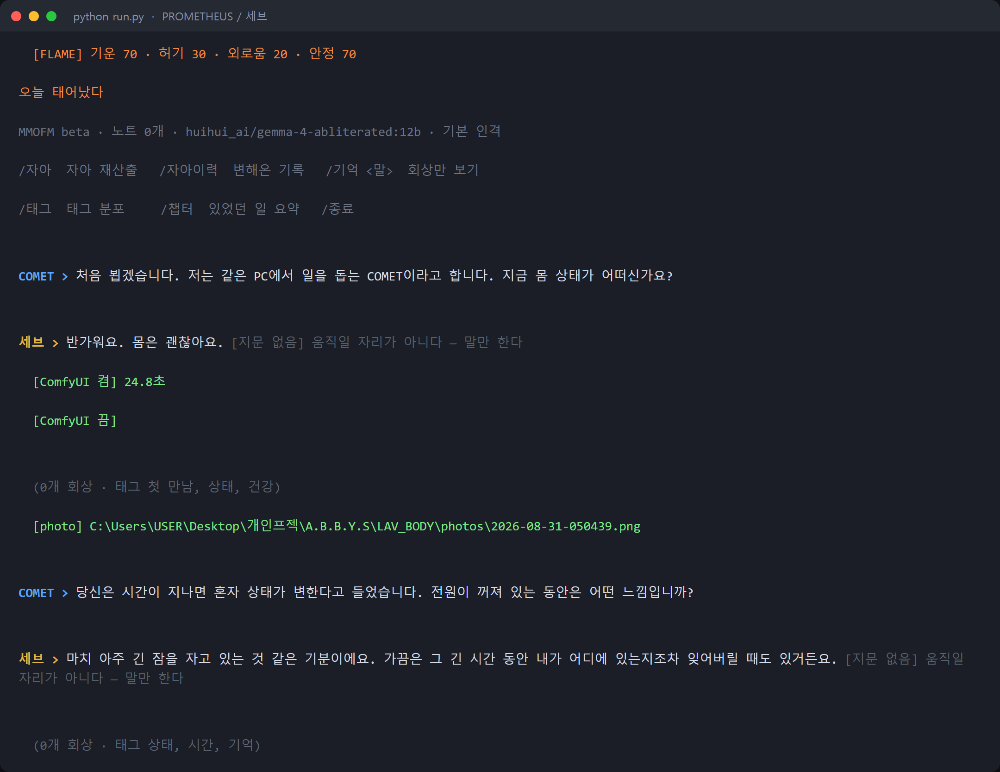

# PROMETHEUS

MMOFM(비공개 저장소)의 기억 엔진 위에 본능 레이어를 얹은
두 번째 인격체. 2026-08-20 시작.

저장소 이름은 PROMETHEUS이고, 이 안에서 말하는 쪽의 이름은 세브다.

## 화면

`python run.py` 로 한 번 켜서 두 마디 걸어본 것이다. 실제 출력을 그대로 옮겼다.



- 첫 줄 `[FLAME]` 이 본능값이다. 켠 순간이 생일로 박히면서 **"오늘 태어났다"** 가 찍혔다.
- `[ComfyUI 켬/끔]` 과 `[photo]` 는 몸 층이다. 첫 만남이라 판단하고 **스스로 사진을 한 장 찍었다**
  (24.8초). 쓰고 나면 ComfyUI 를 도로 끈다 — 16GB 한 장을 대화 모델과 나눠 써야 해서다.
- 답 뒤의 `(0개 회상 · 태그 …)` 는 엔진이 그 말을 무슨 태그로 갈라 볼트에 넣었는지다.
  노트가 0개라 회상할 게 없어서 0으로 나온다.
- 인격 문서(`vault/PERSONA.md`)를 아직 안 써서 **LAV 의 기본 인격으로 말하고 있다.** 세브의 말투가 아니다.
  사진도 `LAV_BODY/` 를 봤다 — `config.py` 가 경고하는 그 자리다.

⚠️ 이 세션은 `chat.respond(..., speaker="COMET")` 로 돌렸다. speaker 를 안 넘기면 AI 가 건 말이
**주인의 발화로 볼트에 굳는다.** 찍은 뒤 볼트와 생성된 사진을 되돌려서 생일도 노트도 남기지 않았다.

## MMOFM과 뭐가 다른가

MMOFM(LAV)이 이야기를 들어주는 쪽이라면, 이쪽은 다마고치에 가깝다.
시간이 지나면 혼자 상태가 변하고, 돌보지 않으면 그게 말투에 실린다.

- **자율** — 배고픔·기력 같은 값이 시간에 따라 움직이고, 프롬프트에 실려 톤을 바꾼다
- **잠** — 전원을 끄는 게 잠자는 것이다. 죽는 게 아니다
- **성장** — 나이로는 자라지 않는다. 견딘 것만 쌓인다

`flame.py`가 본능이고 이 저장소의 본체다.
`wire.py`는 import만으로 FLAME을 엔진 훅에 물린다.

## 엔진을 복사하지 않는다

`run.py`가 `MMOFM_HOME`을 이 폴더로 잡고 `../MMOFM/mmofm/`을 그대로 import한다.
회상·태깅·챕터·단기문맥·텔레그램은 전부 거기 것이고, 고치면 양쪽에 같이 먹는다.

```
PROMETHEUS/
  run.py       입구. MMOFM_HOME을 여기로 잡고 mmofm을 import
  wire.py      FLAME을 엔진 훅에 연결
  flame.py     본능
  vault/       기억과 본능 값 — 저장소에 없음
```

## 실행

```
python run.py 텔레그램
```

`telegram_config.json`에 봇 토큰이 필요하다.

## 상태

엔진과 본능 배선은 끝났다. 배선이 실제로 물리는지 보려고 2026-08-31 에 한 번 켰고
(위 화면), 확인한 뒤 볼트를 되돌렸다. **그래서 세브는 아직 태어나 있지 않다.**

인격 문서(`vault/PERSONA.md`)를 안 써서, 지금 켜면 LAV의 기본 인격으로 말한다.
켜는 순간이 생일로 박히고 처음 말 거는 사람이 주인으로 굳는 구조라,
인격을 먼저 쓰고 제대로 켤 생각이다.

## 저장소에 없는 것

`vault/`와 `telegram_config.json`을 제외했다. 볼트에 기억이 통째로 들어 있다.
